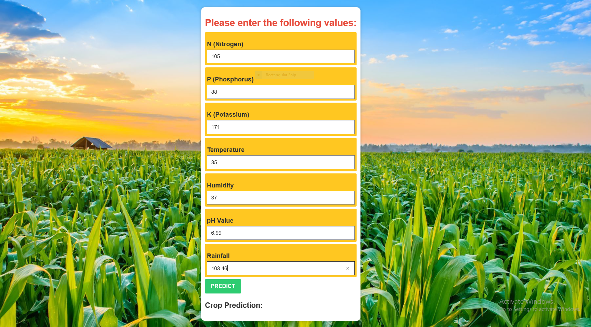

# Crop Recommendation using Machine Learning Algorithms

This project focuses on recommending suitable crops to grow in a particular farm for cultivation based on various environmental factors. The dataset used for this analysis is available on [Kaggle](https://www.kaggle.com/datasets/atharvaingle/crop-recommendation-dataset).

## Dataset Details

The dataset is created by augmenting rainfall, climate, and fertilizer data available for India. It includes the following key fields:

- **N (Nitrogen):** Ratio of Nitrogen content in soil
- **P (Phosphorous):** Ratio of Phosphorous content in soil
- **K (Potassium):** Ratio of Potassium content in soil
- **Temperature:** Soil temperature in degrees Celsius
- **Humidity:** Relative humidity in percentage
- **pH Value:** pH value of the soil
- **Rainfall:** Amount of rainfall in millimeters
  
## Model Performance

| Model                               | Accuracy | Precision | Recall  | F1 Score |
| ----------------------------------- | -------- | --------- | ------- | -------- |
| XGBoost    | 0.9932   | 0.9935    | 0.9932  | 0.9931   |

# Crop Recommendation App using Streamlit

 

This is a simple website  built with Django that provides crop recommendations based on user input. The app takes into account various factors such as temperature, humidity, and rainfall to suggest suitable crops for cultivation.

